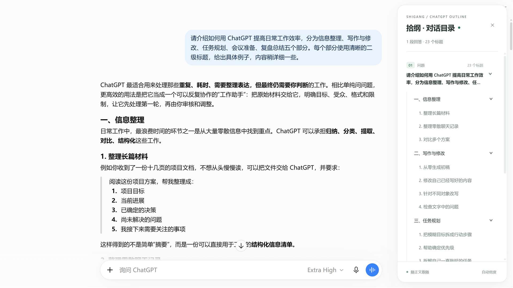
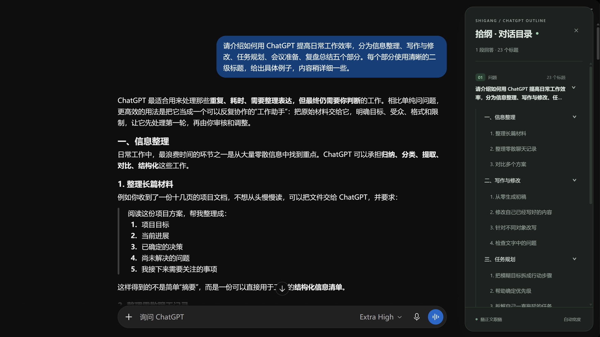

# Shigang - ChatGPT Table of Contents

[简体中文](README.md) | **English**

Shigang adds a collapsible table of contents to long ChatGPT conversations. Browse headings, jump to a section, and follow your reading position without scrolling back and forth.

[Chrome Web Store](https://chromewebstore.google.com/detail/shigang-chatgpt-table-of/gnkgnojbcclcfjelkijmhaaboidhnehk) · [Microsoft Edge Add-ons](https://microsoftedge.microsoft.com/addons/detail/kojdleblcoelmniokkifjjfhmjeaddfj) · [Release v1.0.3](https://github.com/quantai1314/gpt-toc-extension/releases/tag/v1.0.3) · [Report an issue](https://github.com/quantai1314/gpt-toc-extension/issues)

## Features

- Group H1–H6 headings by assistant response, with the related user prompt.
- Jump to a heading or prompt, and collapse responses or nested sections.
- Follow the current reading position without highlighting the conversation.
- Resize the sidebar and save your preferred width on this device. The sidebar adjusts to available space and collapses when space is insufficient.
- Preserve rendered Markdown and math in headings and prompt summaries, including fractions, powers and matrices when the page provides MathML.
- Update while responses stream and when you switch conversations, excluding hidden cached conversations.
- Support light and dark themes, keyboard navigation, English and Simplified Chinese interface labels.

## Install and update

Install from the [Chrome Web Store](https://chromewebstore.google.com/detail/shigang-chatgpt-table-of/gnkgnojbcclcfjelkijmhaaboidhnehk) or [Microsoft Edge Add-ons](https://microsoftedge.microsoft.com/addons/detail/kojdleblcoelmniokkifjjfhmjeaddfj). Refresh [ChatGPT](https://chatgpt.com/) and click **Outline** near the upper-right corner. Store updates are managed by your browser.

For manual installation:

1. Download **shigang-chatgpt-outline-1.0.3.zip** from the [release page](https://github.com/quantai1314/gpt-toc-extension/releases/tag/v1.0.3) and extract it to a folder you will keep.
2. Open `chrome://extensions/` or `edge://extensions/` and enable **Developer mode**.
3. Click **Load unpacked** and select the folder directly containing `manifest.json`.
4. Refresh ChatGPT and click **Outline**.

Node.js and npm are not needed for installation. Keep the extracted folder in place. When updating a manually loaded extension, reload it on the extensions page and then refresh ChatGPT. Disable an older copy if it creates a second outline panel.

## Screenshots

Real usage in light and dark mode, using a Chinese sample conversation. The account avatar and left navigation were cropped out.

## Offline preview

Download and extract the [repository source](https://github.com/quantai1314/gpt-toc-extension/archive/refs/heads/main.zip), then open [ui-preview.html](ui-preview.html) in your browser. This self-contained demo includes sample content and runs without a server, ChatGPT login or extension installation. It is included in the repository source, rather than the extension-only release ZIP.

## Privacy and limitations

Outline processing takes place locally in your browser. Shigang does not upload conversations or provide telemetry. Only your sidebar width preference is saved locally; messages, outline entries, reading position and folding state are not persisted. **Auto width** clears the saved width preference. See the [privacy policy](PRIVACY.md).

Only messages currently loaded in the page are indexed. Responses without H1–H6 headings do not generate heading entries. Math is taken from the page's existing rendered structures; the extension does not download a math library. Changes to the ChatGPT website may affect compatibility.

## Release status

Version **1.0.3** is available in both stores. On 2026-10-07, the real screenshots were submitted as a store listing update: Chrome is pending review and Edge is In review. The existing extension remains available; the new store images appear after approval. This screenshot update did not change the extension code, permissions, version or ZIP package.

The extension ZIP attached to the release is the same package submitted to both stores. SHA-256: `2dd46e628b566efe31a08213ea3bfa815041c3a2a38274389d3a6732ad325f99`.

## Source and license

Maintained by [quantai1314](https://github.com/quantai1314), based on [WindZZzzZZzz/gpt-toc-extension](https://github.com/WindZZzzZZzz/gpt-toc-extension). The original MIT copyright and [license](LICENSE) are retained. Compatibility fixes were also submitted upstream in [PR #20](https://github.com/WindZZzzZZzz/gpt-toc-extension/pull/20).

For development instructions and the dated regression-check records, see the [Chinese README](README.md#本地开发与检查) and [changelog](CHANGELOG.md).
